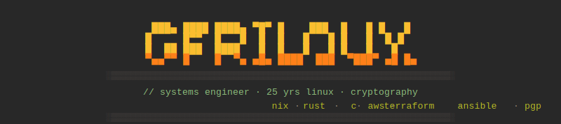
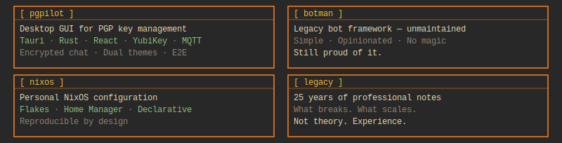
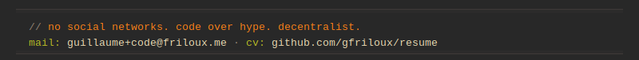

 

Systems engineer with 25 years on Linux. Started on the BBS, learned to code by necessity, built infrastructure at scale. Deep in cryptography, automation, and the Unix philosophy. Nix, Rust, and shell are my languages. AWS and Terraform by day; NixOS and PGP by night. No social networks — I believe they're engineered to be harmful. This isn't anti-social; it's anti-bullshit. I build tools that do one thing well. The code is the message.

 

  

  

  

<picture>
  <source media="(prefers-color-scheme: dark)"
    srcset="https://raw.githubusercontent.com/gfriloux/gfriloux/output/snake-catppuccin.svg" />
  <source media="(prefers-color-scheme: light)"
    srcset="https://raw.githubusercontent.com/gfriloux/gfriloux/output/snake.svg" />
  
</picture>

 

