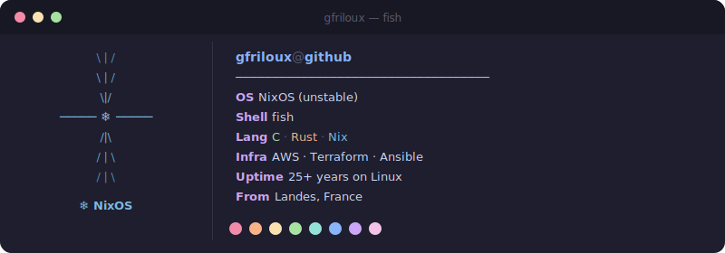

  

  

  

<picture>
  <source media="(prefers-color-scheme: dark)"
    srcset="https://raw.githubusercontent.com/gfriloux/gfriloux/output/snake-catppuccin.svg" />
  <source media="(prefers-color-scheme: light)"
    srcset="https://raw.githubusercontent.com/gfriloux/gfriloux/output/snake.svg" />
  
</picture>

